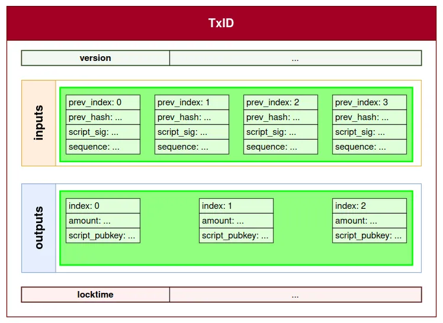
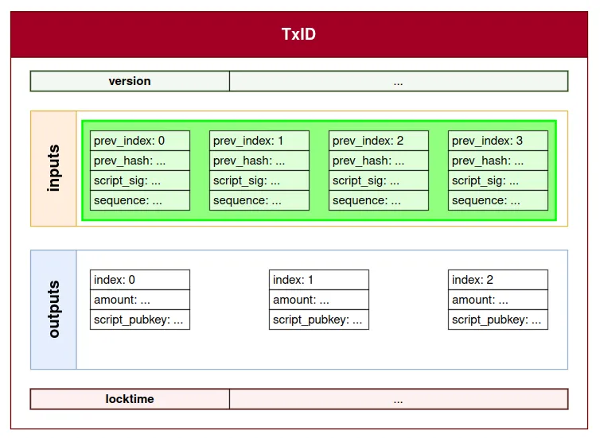
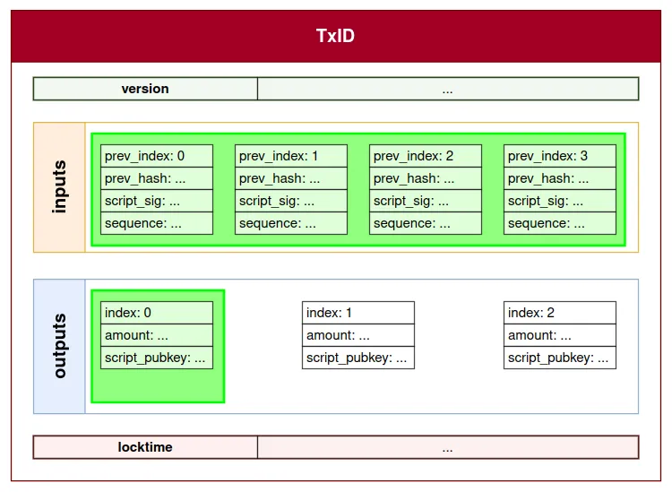
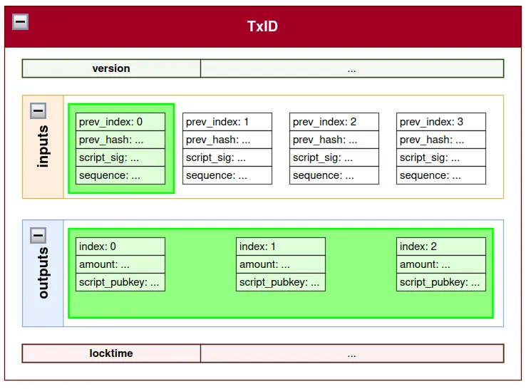
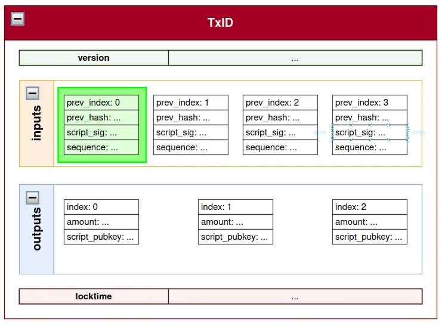
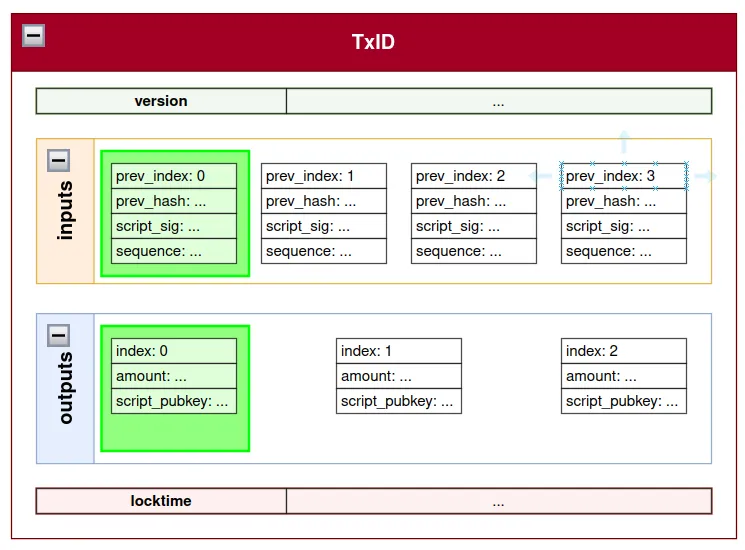

# Bitcoin script test

A simple test of bitcoin script. 

## Scripts

### P2PKH

Lock script: OP_DUP OP_HASH160 OP_PUSHBYTES_20 `<PK_Hash>` OP_EQUALVERIFY OP_CHECKSIG

Unlock script: OP_PUSHBYTES_71 `<Signature>` OP_PUSHBYTES_33 `<PK>`

Check:
* OP_HASH160(PK) = PK_Hash
* OP_EQUALVERIFY verify signature

Ref: [rust-bitcoin/bitcoin/src/blockdata/script/borrowed.rs#L190](https://github.com/rust-bitcoin/rust-bitcoin/blob/5cca2f271d04141e1ec7d28cc07add8f2bc9b404/bitcoin/src/blockdata/script/borrowed.rs#L190)


### P2SH

Lock script: OP_HASH160 OP_PUSHBYTES_20 `<Script_Hash>` OP_EQUAL

Unlock script: OP_PUSHBYTES_* DATA1 OP_PUSHBYTES_* DATA2 ... OP_PUSHBYTES_* DATAn

DATAn is the redeem script. 

Check:
* OP_HASH160(DATAn) = Script_Hash
* execute redeem script

Ref: [rust-bitcoin/bitcoin/src/blockdata/script/borrowed.rs#L181](https://github.com/rust-bitcoin/rust-bitcoin/blob/5cca2f271d04141e1ec7d28cc07add8f2bc9b404/bitcoin/src/blockdata/script/borrowed.rs#L181)

### P2WPKH

The signature (witness) part is separated from the input part of the transaction, thereby improving the efficiency and scalability of the transaction. The locking script only contains the public key hash, while the unlocking script (witness) contains the signature and the public key.

Lock script: OP_0 OP_PUSHBYTES_20 `<PK_Hash>`

Unlock script: None

Witness: 0x02 0x48 Signature 0x21 PK

Check: same as P2PKH

Ref: [rust-bitcoin/bitcoin/src/blockdata/script/borrowed.rs#L285](https://github.com/rust-bitcoin/rust-bitcoin/blob/5cca2f271d04141e1ec7d28cc07add8f2bc9b404/bitcoin/src/blockdata/script/borrowed.rs#L285)

### P2WSH

Lock script: OP_0 OP_PUSHBYTES_32 `<Script_Hash>`

Unlock script: None

Witness: stackitems(VarInt) stackitem1_size stackitem1 stackitem2_size stackitem2 ... stackitemn_size stackitemn

The stackitemn is the redeem script. Data1..n push into stack. 

Check: same as P2SH

Ref: 
[rust-bitcoin/bitcoin/src/blockdata/script/borrowed.rs#L277](https://github.com/rust-bitcoin/rust-bitcoin/blob/5cca2f271d04141e1ec7d28cc07add8f2bc9b404/bitcoin/src/blockdata/script/borrowed.rs#L277)

[rust-bitcoin/bitcoin/src/blockdata/witness.rs#L468](https://github.com/rust-bitcoin/rust-bitcoin/blob/5cca2f271d04141e1ec7d28cc07add8f2bc9b404/bitcoin/src/blockdata/witness.rs#L468)

### P2TR

Lock script: OP_1 OP_PUSHBYTES_32 `<Taproot_PK>`

Unlock script: None

#### Key path spending

witness: signature

* CheckSchnorrSignature(signature, Taproot_PK, hash(Lock Script) => sighash) == 1

##### Script path spending 

witness: stackitems(VarInt) stackitem1_size stackitem1 stackitem2_size stackitem2... stackitemn_size stackitemn

stackitemn is control(internal_key, merkle_path), stackitemn-1 is script.

1. ComputeTapleafHash(script) => tapleaf_hash
2. ComputeTaprootMerkleRoot(control.merkle_path, tapleaf_hash) => merkle_root
3. ComputeTapTweakHash(&merkle_root) => merkle_root_hash
4. ComputeTapTweak(merkle_root_hash, control.internal_key) => control.internal_key + merkle_root_hash * G == control.Taproot_PK
5. execute script

Ref: [rust-bitcoin/bitcoin/src/blockdata/script/borrowed.rs#L293](https://github.com/rust-bitcoin/rust-bitcoin/blob/5cca2f271d04141e1ec7d28cc07add8f2bc9b404/bitcoin/src/blockdata/script/borrowed.rs#L293)

### OP_RETURN

ASM: OP_RETURN `<data>`

The OP_RETURN standard locking script just contains the OP_RETURN opcode followed by a data push of up to 80 bytes. This data push can contain any data you like, but it's commonly used for storing ASCII-encoded text strings. 

**This locking script cannot be unlocked, so don't use it to lock up any amount of bitcoins.**

Ref: [rust-bitcoin/bitcoin/src/blockdata/script/borrowed.rs#L304](https://github.com/rust-bitcoin/rust-bitcoin/blob/5cca2f271d04141e1ec7d28cc07add8f2bc9b404/bitcoin/src/blockdata/script/borrowed.rs#L304)


## SigHash

### SIGHASH_ALL

SIGHASH_ALL, given a transaction Tx, the signature applies to all of Tx’s inputs and all its outputs (see green bounding boxes). SIGHASH_ALL is applied by

1. Creating a copy of the transaction
2. Empty script_sigs for each input and replace with the script_pubkey they reference. This is done because the "signature is part of the script_sig and … can’t sign itself"
3. Make sure that no other fields are set to empty before the transaction is serialized (Tx_ser)
4. The flag 0x01 is added to the end of the serialized transaction and passed through a hashing function
5. This message is then signed by the signing algorithm to generate the signature

<center>
  
</center>
<!--  -->

### SIGHASH_NONE

SIGHASH_NONE, the signature applies to all of Tx’s inputs (see green bounding box) but to none of the outputs. The application process is as stated below:

1. Create a copy of the transaction
2. Empty each script_sig for all inputs and replace with the script_pubkey they reference
3. Empty out all output fields
4. Serialize the transaction
5. Append 0x02 to Tx_ser, hash, and then sign

<center>
  
</center>
<!--  -->

### SIGHASH_SINGLE

SIGHASH_SINGLE, all the inputs of the given transaction Tx are signed and one output that has the same index of one of the inputs being signed. This is essentially "authorizing all other inputs to go with a specific output".

1. Create a copy of the transaction
2. Empty script_sigs for each input and replace with the script_pubkey they reference
3. Empty out all output fields bar the specific output
4. Serialize the transaction
5. Append 0x03 to Tx_ser, hash, and then sign

<center>
  
</center>
<!--  -->


### SIGHASH_ANYONECANPAY
With ANYONECANPAY set for ALL, changes can be made to all inputs except the select input (index 0) and the outputs (see image below).

<center>
  
</center>
<!--  -->

ANYONECANPAY set for NONE means that changes can be made to all outputs, and inputs except the current input.

<center>
  
</center>
<!--  -->

ANYONECANPAY set for SINGLE means that changes can be made to all outputs except the output with a matching index with the current input. All other inputs can be modified, added, and/or removed.

<center>
  
</center>
<!--  -->

Ref: [Signature Hash Flags](https://www.btcstudy.org/2022/04/26/signature-hash-flags-by-ochekiye/)

## Utils 

sha256 online: https://www.lzltool.com/data-sha256

ripemd160 online: http://web.chacuo.net/charsetripemd160


## Ref

### OP_HASH160

res = ripemd160(sha256(data))

### Witness

[example tx: 2c3ce072e32f49644a40a3d92d979e7fdd7d3f38f49db3f08e55e5e2f17e409a](https://www.blockchain.com/explorer/transactions/btc/2c3ce072e32f49644a40a3d92d979e7fdd7d3f38f49db3f08e55e5e2f17e409a)

witness: 
```
  "inputs": [
    {
      "coinbase": false,
      "txid": "3a702e3f03591c158e3e4fee843b8db875510767a8fbee645d866da51b0f83fa",
      "output": 1,
      "sigscript": "",
      "sequence": 4294967293,
      "pkscript": "0020a65a74e2f3b3da24513ab14baf090d1a4ff860aafee1713d2d92a46f16a19c86",
      "value": 40606358,
      "address": "bc1q5ed8fchnk0dzg5f6k9967zgdrf8lsc92lmshz0fdj2jx794pnjrqnux44d",
      "witness": [
        "",
        "3045022100a8370520fe61c9eb55eab0207702e0d8a77afcdf2243202203fb1268df333ee802203862ca029d0afd54a55bab007d3b38201b2c032cb8f841a523fe30fc99dcf49d01",
        "3045022100aff60b14af50f68506057760328e7012f5f821de824e4c9ef43f636eb27233d7022009e4a222073fd9161e2c39aae3120b23ad851ffb78ca9d375007780efbf3187c01",
        "52210209f1f641a9871acea5698cd38401aabd77a6f6bf1804f57d04b379cba9235fff210243333533dd38308b7660b7c89694dc606af241d364c6dd4161bf9a877ccc207821029f55600c0f8f87c1bec37a0310e0ae8558e4217475afd7e3db12e6ad35284ca153ae"
      ]
    }
  ]
```

redeem script: 
```
hex: 52210209f1f641a9871acea5698cd38401aabd77a6f6bf1804f57d04b379cba9235fff210243333533dd38308b7660b7c89694dc606af241d364c6dd4161bf9a877ccc207821029f55600c0f8f87c1bec37a0310e0ae8558e4217475afd7e3db12e6ad35284ca153ae

ASM: OP_PUSHNUM_2 OP_PUSHBYTES_33 0209f1f641a9871acea5698cd38401aabd77a6f6bf1804f57d04b379cba9235fff OP_PUSHBYTES_33 0243333533dd38308b7660b7c89694dc606af241d364c6dd4161bf9a877ccc2078 OP_PUSHBYTES_33 029f55600c0f8f87c1bec37a0310e0ae8558e4217475afd7e3db12e6ad35284ca1 OP_PUSHNUM_3 OP_CHECKMULTISIG
```

### P2TR example

[example tx: 905ecdf95a84804b192f4dc221cfed4d77959b81ed66013a7e41a6e61e7ed530](https://blockstream.info/tx/905ecdf95a84804b192f4dc221cfed4d77959b81ed66013a7e41a6e61e7ed530)

How to check p2tr script? See in [main.rs](./src/main.rs).

### SIGHASH example

[example tx: 6adf27a500eb592d49a1732ab338e38815f6d4986636566755a68b1147c57d18](https://www.blockchain.com/explorer/transactions/btc/6adf27a500eb592d49a1732ab338e38815f6d4986636566755a68b1147c57d18)

How to calculate sighash of transaction? See in [main.rs](./src/main.rs).
